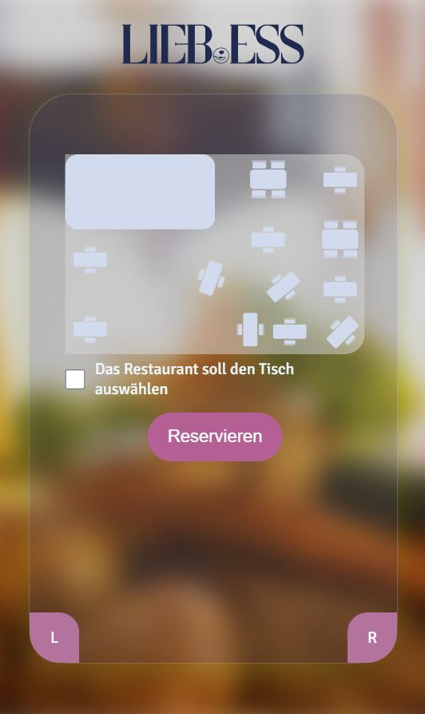

# Liebess Reservation System

## Overview

Liebess Reservation System is an application designed to facilitate table reservations at the restaurant Liebess. However, it is adaptable for use in any restaurant with minor modifications such as updating the SVG table map. Users can conveniently reserve tables by submitting a form and interacting with a custom-built SVG map representing the restaurant's layout. Future iterations will integrate React to enhance the user experience, providing users with a unique code for modifying reservation details.

## Features

- **Table Reservation**: Users can reserve tables by submitting a form.
- **Interactive SVG Map**: Users can visually select their desired table from a custom-built SVG map of the restaurant's layout.
- **Scalability**: The system can be easily adapted for use in any restaurant with minimal adjustments.
- **Future Enhancements**: Integration of React will provide a more seamless user experience and enable features such as unique codes for modifying reservation details.

## Technologies Used

- HTML/CSS
- JavaScript
- Express.js
- Mongodb
- React (planned for future iterations)

## Getting Started

To use the Liebess Reservation System, follow these steps:

1. Clone the repository to your local machine.
2. Update the SVG map with your restaurant's layout.
3. Deploy the application on your preferred hosting platform.
4. Start accepting table reservations from your customers!

## License

This project is licensed under the [MIT License](https://opensource.org/licenses/MIT).